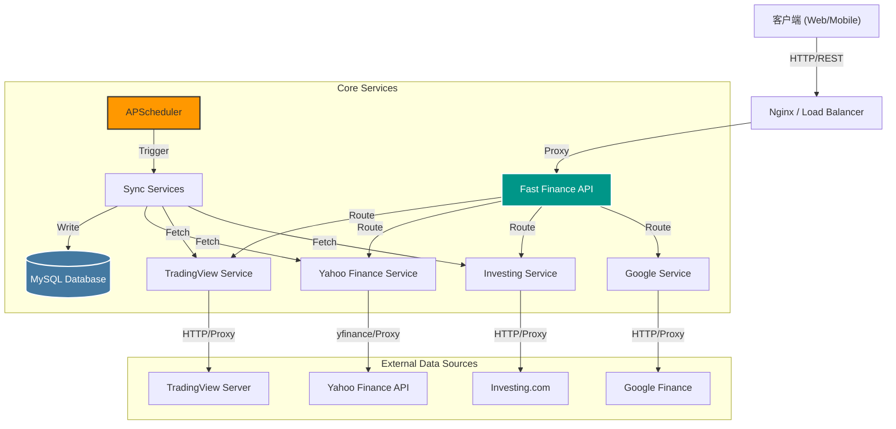

# Fast Finance API

<div align="center">


**全方位金融数据聚合网关 | 高性能 • 易扩展 • 自动化**

[快速开始](#快速开始) • [文档](#API-文档) • [配置](#配置说明) • [贡献](#贡献指南)

</div>

---

## 📖 项目简介

**Fast Finance API** 是一个基于 **FastAPI** 构建的现代化异步后端服务，旨在为金融应用提供统一、标准化的数据接口。它不仅封装了 **TradingView**、**Yahoo Finance**、**Investing.com** 和 **Google Finance** 等多个主流金融数据源，还内置了**定时任务调度器**，支持自动化数据同步和持久化存储。

### 核心特性

- ⚡ **高性能异步架构**: 基于 FastAPI + Uvicorn，并使用异步 I/O 处理高并发数据请求。
- 🔌 **多源数据集成**:
    - **TradingView**: 实时技术指标分析 (TA)、筛选器数据、从服务器同步数据。
    - **Yahoo Finance**: 全面的股票基本面、K线、财报、新闻数据。
    - **Investing.com**: 宏观经济数据、市场指数同步。
    - **Google Finance**: 实时报价补全。
- 🤖 **自动化任务调度**: 内置 APScheduler，支持定时同步股票行情、市场数据，并提供可视化管理面板。
- 🗄️ **数据持久化**: 集成 MySQL 数据库，用于存储同步的历史数据和任务执行日志。
- 🌍 **灵活代理配置**: 支持为不同数据源配置独立的代理服务器，确保全球数据访问的稳定性。
- 🐳 **生产级部署**: 提供完整的 Docker Compose 配置，开箱即用。

## 🏗️ 系统架构



## 🚀 快速开始

### 前置条件
- **Docker** & **Docker Compose** (推荐)
- **MySQL** (如果是本地开发，需自备数据库或使用 Docker 启动)
- Python 3.10+ (仅本地开发需要)

### 方式一：Docker 容器化运行 (推荐)

最简单、最稳定的运行方式。

1. **配置环境变量**
   复制示例配置（如果有）或直接创建 `.env` 文件：
   ```bash
   # .env
   MYSQL_SERVER=host.docker.internal # 如果连接宿主机 DB
   MYSQL_USER=root
   MYSQL_PASSWORD=your_password
   MYSQL_DB=fast_finance
   ```

2. **构建并启动服务**
   ```bash
   docker-compose up -d --build
   ```

3. **验证服务**
   - 健康检查：`http://localhost:9130/api/v1/system/health`
   - 任务后台：`http://localhost:9130/static/scheduler.html`

4. **查看日志**
   ```bash
   docker-compose logs -f app
   ```

### 方式二：本地开发运行

适用于开发调试和代码贡献。

1. **环境准备**
   ```bash
   # 创建虚拟环境
   python -m venv venv
   source venv/bin/activate  # Windows: venv\Scripts\activate
   
   # 安装依赖
   pip install -r requirements.txt
   ```

2. **配置数据库**
   确保本地 MySQL 服务已启动，并在 `.env` 中正确配置数据库连接信息。
   
   **注意**: 服务启动时会自动执行 `DBManager.init_db()` 初始化表结构。

3. **启动服务**
   ```bash
   # 使用 uvicorn 启动热重载
   uvicorn app.main:app --reload --host 0.0.0.0 --port 9130
   ```

## 📚 API 文档

服务启动后，可访问交互式 API 文档：

- **Swagger UI**: [http://localhost:9130/docs](http://localhost:9130/docs)
    - 包含所有接口的详细定义、参数说明和在线测试功能。
- **任务调度面板**: [http://localhost:9130/static/scheduler.html](http://localhost:9130/static/scheduler.html)
    - 查看定时任务状态、执行历史和日志。

### 模块概览

| 模块 | 路径前缀 | 描述 |
| :--- | :--- | :--- |
| **System** | `/api/v1/system` | 健康检查、系统状态 |
| **Yahoo Finance** | `/api/v1/yahoo` | 股票详情、K线、财报、新闻、数据同步 |
| **TradingView** | `/api/v1/tradingview` | 技术分析 (TA)、筛选器、数据同步 |
| **Investing** | `/api/v1/investing` | 宏观数据、指数同步 |
| **Google** | `/api/v1/google` | 实时报价查询 |
| **Scheduler** | `/api/v1/scheduler` | 任务调度器管理 (控制面板 API) |
| **AI Help** | `/api/v1/ai_help` | AI 辅助功能接口 |

## ⚙️ 配置说明

项目配置通过 `pydantic-settings` 管理，支持 `.env` 文件覆盖默认值。

| 变量名 | 默认值 | 说明 |
| :--- | :--- | :--- |
| **基础配置** | | |
| `API_V1_STR` | `/api/v1` | API 路径版本前缀 |
| `PROJECT_NAME` | `Fast Finance API` | Swagger 文档标题 |
| `PORT` | `9130` | 服务监听端口 |
| `DEBUG` | `True` | 是否开启调试模式 |
| `LOG_LEVEL` | `INFO` | 日志级别 |
| **数据库配置** | | |
| `MYSQL_SERVER` | `host.docker.internal` | 数据库地址 |
| `MYSQL_PORT` | `3306` | 数据库端口 |
| `MYSQL_USER` | `root` | 数据库用户名 |
| `MYSQL_PASSWORD` | - | 数据库密码 |
| `MYSQL_DB` | `fast_finance` | 数据库名称 |
| **代理配置** | | **可选：为特定源配置 HTTP/HTTPS 代理** |
| `PROXY_YAHOO` | `None` | Yahoo Finance 专用代理 |
| `PROXY_TRADINGVIEW`| `None` | TradingView 专用代理 |
| `PROXY_INVESTING` | `None` | Investing.com 专用代理 |
| `PROXY_GOOGLE` | `None` | Google Finance 专用代理 |

## 📂 项目结构

```text
fast-finance/
├── app/
│   ├── api/             # API 路由 (Endpoints)
│   ├── core/            # 核心组件 (Config, DB, Logger, Scheduler)
│   ├── schemas/         # Pydantic 数据模型 (DTOs)
│   ├── services/        # 业务逻辑层 (Yahoo, TV, Investing...)
│   │   ├── *_service.py      # 具体业务逻辑
│   │   └── *_sync_service.py # 数据同步逻辑
│   └── main.py          # 应用入口
├── docs/                # 文档
├── data/                # 示例数据或临时存储
├── tests/               # 测试用例
├── static/              # 静态资源 (如 scheduler.html)
├── docker-compose.yml   # 容器编排
├── Dockerfile           # Docker 构建文件
├── requirements.txt     # Python 依赖
└── README.md            # 项目说明
```

## 🤝 贡献指南

1. Fork 本仓库。
2. 创建特性分支 (`git checkout -b feature/AmazingFeature`)。
3. 提交更改 (`git commit -m 'Add some AmazingFeature'`)。
4. 推送到分支 (`git push origin feature/AmazingFeature`)。
5. 开启 Pull Request。

## 📄 许可证

本项目基于 [MIT 许可证](LICENSE) 开源。
